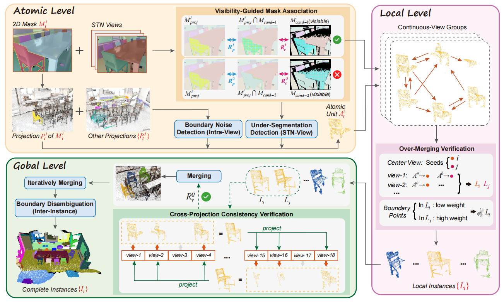

<div align="center">

# HC-3DIS: A Hierarchical Consensus Framework for Efficient Zero-Shot 3D Instance Segmentation with Embedded Denoising
**Feng Xiao** · **Tianming Xie** · **Wenxiong Kang**  
*South China University of Technology*  

[Code](https://github.com/onmyoji-xiao/hc3dis) | [Paper]() | [Project Page])  


</div>

## Environment
```
git clone https://github.com/onmyoji-xiao/hc3dis.git
cd hc3dis/

conda create -n hc3dis python=3.10
conda activate hc3dis

pip install torch==2.2.1 torchvision==0.17.1 --index-url https://download.pytorch.org/whl/cu121
pip install -r requirement.txt

```
# Installing PyTorch3D
**Download the pre-built package**  
 Visit the official PyTorch3D conda channel and download the package matching your environment:
 ```
 # For Python 3.10 + PyTorch 2.2.0 + CUDA 12.1
 wget https://anaconda.org/pytorch3d/pytorch3d/0.7.8/download/linux-64/pytorch3d-0.7.8-py310_cu121_pyt220.tar.bz2

 pip install pytorch3d-0.7.8-py310_cu121_pyt220.tar.bz2

```

## Data Preparation

Our data preparation pipeline for **ScanNet200** and **ScanNet++** strictly follows the official workflow of [MaskClustering](https://github.com/PKU-EPIC/MaskClustering) to ensure reproducibility and fair comparison.

## Model Preparation
We strictly follow the model preparation pipeline from [MaskClustering](https://github.com/PKU-EPIC/MaskClustering) to download and configure the required pre-trained weights. Our framework relies on two frozen foundation models:

- **CropFormer**: Used to process individual RGB frames and generate high-quality 2D instance segmentation priors. These 2D masks are automatically lifted into 3D space via camera projection geometry to serve as structural cues for instance aggregation.
- **CLIP**: Employed to extract multi-scale visual features from the generated 2D masks for open-vocabulary semantic assignment.

All models are kept frozen during inference to ensure a strictly training-free workflow. 

## Demo

